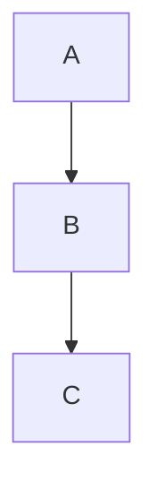
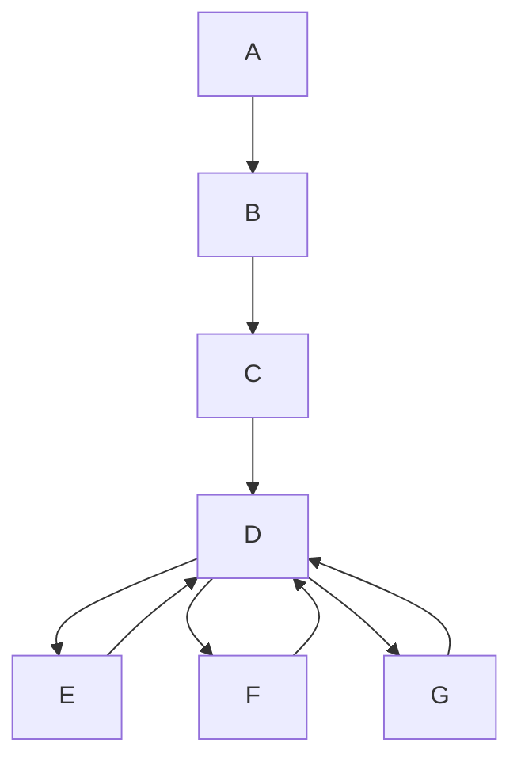
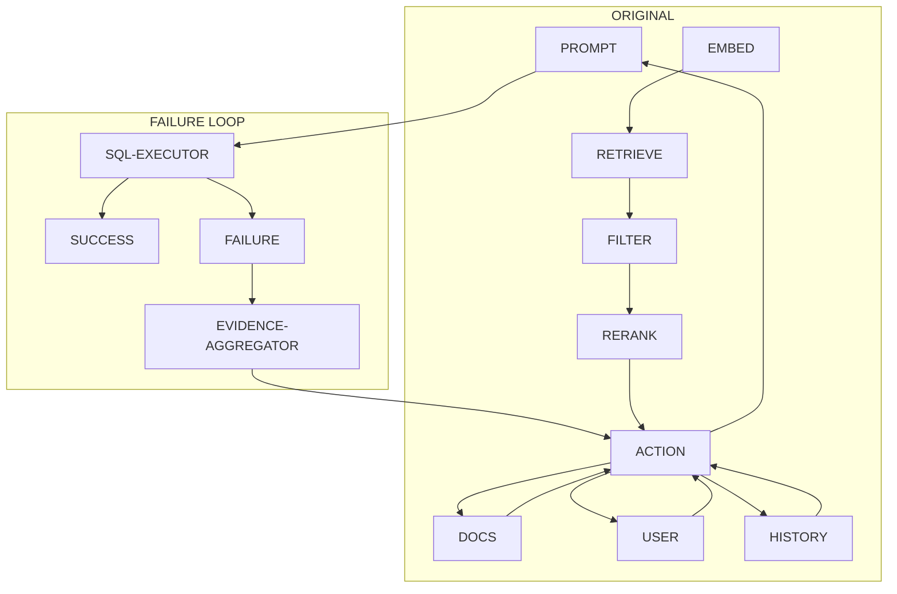

# Everything is just mdx 

Most of GFH (GitHub Flavoured Markdown) is respected by default.

## How many roads must a man walk down?

```javascript
const random = Math.floor(Math.random()*1000) + 1
console.log(`${random} roads.`)
```

and

```go
package main

import (
	"fmt"
	"gonum.org/v1/gonum/blas/blas64"
	"gonum.org/v1/gonum/lapack/lapack64"
	"gonum.org/v1/gonum/mat"
	blasnetlib "gonum.org/v1/netlib/blas/netlib"
	lapacknetlib "gonum.org/v1/netlib/lapack/netlib"
	"math/rand"
	"time"
)

func init() {
	blas64.Use(blasnetlib.Implementation{})
	lapack64.Use(lapacknetlib.Implementation{})
}

func main() {
	t1 := time.Now()
	data := make([]float64, 2000*2000)
	for i := range data {
		data[i] = rand.Float64()
	}
	t2 := time.Now()
	a := mat.NewDense(2000, 2000, data)
	t3 := time.Now()
	a.Mul(a.T(), a)
	t4 := time.Now()
	var eigen mat.Eigen
	eigen.Factorize(a, mat.EigenNone)

	t5 := time.Now()
	svd := new(mat.SVD)

	svd.Factorize(a, mat.SVDNone)
	t6 := time.Now()

	fmt.Println("Total time taken:", time.Since(t1))
	fmt.Println("Time taken to generate data:", t2.Sub(t1))
	fmt.Println("Time taken to create matrix:", t3.Sub(t2))
	fmt.Println("Time taken to multiply matrix:", t4.Sub(t3))
	fmt.Println("Time taken to calculate eigenvalues:", t5.Sub(t4))
	fmt.Println("Time taken to calculate svd:", t6.Sub(t5))
}
```

## You can also include nice memes 

Just inline image it like this:


### Latency is slow. 

To make up for lost time, you can enjoy blockquotes:

> "We are not accustomed to measuring our everyday encounters in milliseconds, but studies have shown that most of us will reliably report perceptible “lag” once a delay of over 100–200 milliseconds is introduced into the system. Once the 300 millisecond delay threshold is exceeded, the interaction is often reported as “sluggish,” and at the 1,000 milliseconds (1 second) barrier, many users have already performed a mental context switch while waiting for the response—anything from a daydream to thinking about the next urgent task.

-- Ilya Grigorik, High Performance Browser Networking [^1].


##### Mermaid charts are fun

A deterministic set of instructions, 

> Do A, then B, then C, then D, then E.



We could change this, and instead, you could tell an omnipotent deity:
> Salam, deus, you have a set of "actions" you can take. You must use *initially* use your abilities in a specific order A --> B --> C, however, after that point, you are free to choose whichever action you like.





##### More reasons why mermaid is nice: 

Enter, the subgraph:




##### An even more involved Mermaid diagram 

```mermaid
%%{init: {'theme': 'forest', 'fontSize': 48, 'barHeight': 36, 'taskTextRight': 'always', 'titleTopMargin': 50,  "flowchart" : { "curve" : "basis" }} }%%
gantt
    dateFormat  s 
    axisFormat  %S.%Ls
    title       Latency Comparison
    excludes    weekends
    %% (`excludes` accepts specific dates in YYYY-MM-DD format, days of the week ("sunday") or "weekends", but not the word "weekdays".)

    section N different services
    Post to Embed           :crit, a1, 0, 0.4s
    Embedding                :a2, after a1, 0.1s
    Receive from Embed       :crit, a3, after a2, 0.4s
    Post to VectorDB            :crit, a4, after a3, 0.4s
    DB Query            :a5, after a4, 0.1s
    Receive from VectorDB            :crit, a6, after a5, 0.4s
    Filter    :a7, after a6, 0.1s
    Post to ReRank    :crit, a8, after a7, 0.4s
    ReRank    :a9, after a8, 0.8s
    Receive from ReRank    :crit, a10, after a9, 0.4s
    Post to Prompt    :crit, a11, after a10, 0.4s
    TTFT    :a12, after a11, 0.4s
    
    section OneContext 
    Post to OneContext           :crit, b1, 0, 0.4s
    Embedding                :b2, after b1, 0.1s
    DB Query            :b3, after b2, 0.1s
    Filter    :b4, after b3, 0.1s
    ReRank    :b5, after b4, 0.8s
    TTFT    :b6, after b5, 0.4s
```




### Oh you can also embed YouTube iframes directly. [^2]

<comp.YouTube id={`usn6IFPFEOs`}/>

[^1]: High Performance Browser Networking, Ilya Grigorik. Buy it [here](https://www.amazon.co.uk/High-Performance-Browser-Networking-performance/dp/1449344763).
[^2]: Kudos to [this guy](https://forrestbrazeal.com) for this gem.
